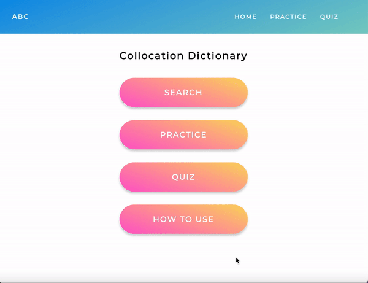

# Collocation-Dictionary

## About this app
Collocation-Dictionary is a react web application utilizing fetching API to search collocations and their usage, along with practice and quiz features for personal learning.

## Technologies used
- MongoDB
- Express.JS
- React.JS
- Node.JS
- Redux Toolkit
- Axios
- React-quizlet-flashcard
- Styled-components
- MUI

## Front end - client



**Search Page**<br/>
Users can search for a collocation by typing a verb, noun, or adjective.<br/>
They can add collocations to a wordlist for later practice.<br/>
**Practice Page**<br/>
Users can practice the collocations in the wordlist with flashcards, collocations on which front side, and examples on which back.<br/>
**Quiz Page**<br/>
Users can test by typing collocations after choosing a certain verb, noun, or adjective that they want to test.<br/>
**How To Use**<br/>
A modal displays the details of how to use this application.

## Backend
**Wordlist**<br/>
Collocations, examples, and ids are stored in MongoDB for later use.

## Challenging part
API provides fixed data types and structures, so it was challenging to change them into the ones that suited my application.<br/>
Here is the solution:

(Practice.jsx)<br/>
```
    const res = await publicRequest.get('/wordlist')

    let sub_array = [];
    for (let i = 0; i < res.data.length; i++) {
        const obj = {
            id: res.data[i]._id,
            front: res.data[i].front,
            back: res.data[i].back.join()
        };
        sub_array.push(obj);
    }
```

## License
Linguatools English Collocations API - [RapidAPI](https://rapidapi.com/hub)


